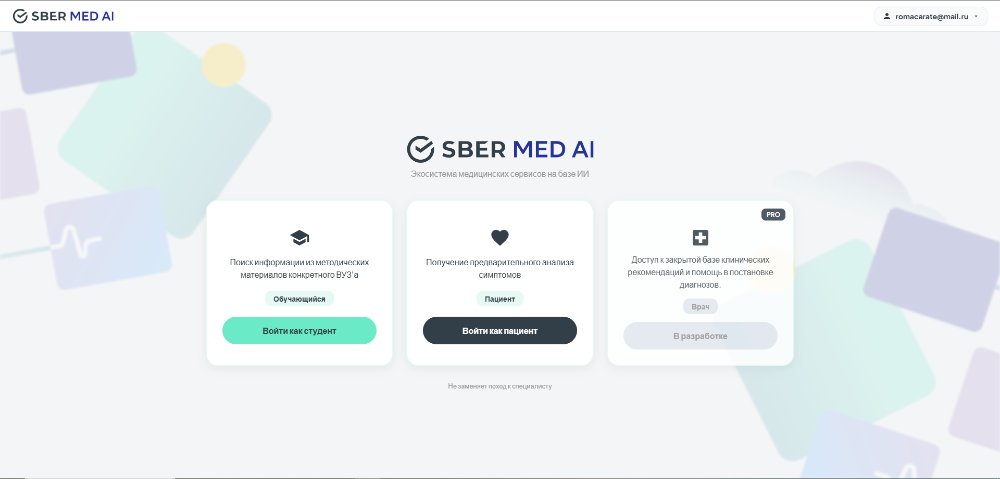
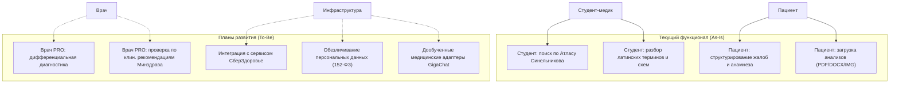
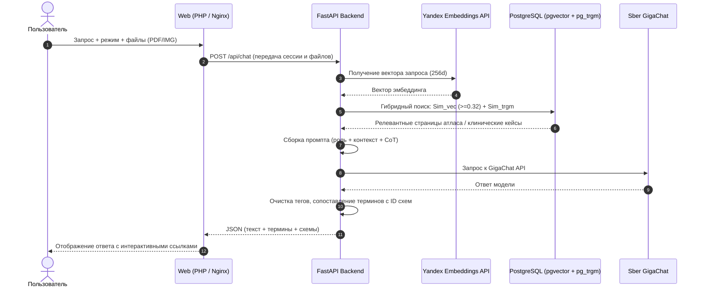

# SberMedAI — Интеллектуальный медицинский ассистент и RAG-система

Прототип платформы на базе языковой модели Sber GigaChat и векторного поиска по проверенным медицинским первоисточникам.

Проект решает проблему ошибок и галлюцинаций сторонних нейросетей в медицинской и анатомической номенклатуре. Система не придумывает факты, а находит подтвержденные данные в оцифрованной базе знаний (на данный момент в виду ограничений она содержит атлас анатомии Синельникова, словарь терминов Чернявского и клинический датасет MTS-Dialog) и возвращает точный ответ со ссылкой на оригинальные анатомические схемы.

---

## Стек технологий

* LLM и эмбеддинги: Sber GigaChat API (GigaChat-2-Max, GigaChat-2), Yandex Foundation Models (Text Embeddings 256d). Эмбеддинги яндекса использованы из-за того, что у ГигаЧата они платные, при разработке я использовал бесплатные инструменты.
* Бэкенд: Python 3.11, FastAPI, Uvicorn, Psycopg2, Httpx, PyMuPDF, python-docx.
* База данных и поиск: PostgreSQL 16 с расширениями pgvector (векторный поиск) и pg_trgm (триграммное сходство).
* Фронтенд: PHP 8.2 (Apache), JavaScript (Canvas 2D), CSS под дизайн-систему Сбера, PHPMailer.
* Инфраструктура: Docker, Docker Compose, Nginx Reverse Proxy.

---

## Реализованная функциональность

### 1. Гибридный RAG-пайплайн и формула поиска
Поиск в базе знаний объединяет плотные векторные эмбеддинги и разреженное триграммное сопоставление.

Формула расчета векторного сходства:
$$\text{Sim}_{\text{vec}}(\mathbf{u}, \mathbf{v}) = 1.0 - (\mathbf{u} \Leftrightarrow \mathbf{v})$$
где **u** — 256-мерный эмбеддинг запроса, **v** — сохраненный вектор документа, а `<=>` — косинусное расстояние в pgvector.

Итоговый алгоритм отбора контекста:
1. Вычисление векторного расстояния с фильтрацией по порогу релевантности: `Sim_vec >= 0.32`.
2. Триграммный скоринг через расширение `pg_trgm`: `Sim_trgm = similarity(term_ru, query)` для точного совпадения сложных латинских и русских медицинских терминов.
3. Ранжирование кандидатов с приоритетом по типу сущности (структуры атласа, словарные статьи, клинические диалоги).

### 2. Промпт-инжиниринг и контроль генерации
* Разделение системных ролей: режим студента (академическая анатомическая номенклатура, этиология, топография) и режим пациента (доступный язык, сбор анамнеза, напоминание о визите к врачу).
* Chain-of-Thought (CoT): пошаговая инструкция для модели по анализу симптомов и исключению критических состояний.
* Постобработка: удаление тегов рассуждений и автоматическая разметка анатомических сущностей для интерактивного просмотра схем.

### 3. Оцифровка и подготовка датасетов (Data Engineering)
* Атлас анатомии Синельникова: структурирован в JSON с привязкой страниц, латинских названий и схем и занесен в таблицу БД.
* Словарь Чернявского: 7 200+ словарных статей, морфем и правил словообразования.
* MTS-Dialog: 1 700+ клинических диалогов переведены и размечены для сценария пациента и последующего дообучения.

### 4. Мультимодальность
* Парсинг медицинских выписок и лабораторных анализов в форматах PDF и DOCX.
* Передача медицинских снимков и графиков в визуальный контур модели через Files API.

---

## Режимы работы

### Режим Студента
Ориентирован на изучение анатомии и медицинской латыни. При запросе система находит нужный фрагмент атласа, подсвечивает термин в ответе и по клику показывает иллюстрацию с разметкой.

### Режим Пациента
Ориентирован на опрос по жалобам и структурирование анамнеза. Помогает пациенту сформулировать симптомы и объясняет назначение базовых анализов.

---

## Архитектура и диаграммы

### 1. Use-Case: текущее состояние (As-Is) и развитие (To-Be)

### 2. Диаграмма последовательности (RAG Pipeline)

---

## Планы по развитию проекта (Roadmap)

1. Дообучение моделей GigaChat (Fine-Tuning / PEFT):
   * Дообучение моделей линейки GigaChat (GigaChat Lite / Pro) на медицинском корпусе текстов и датасете диалогов для генерации точных врачебных заключений и анамнеза.
2. Интеграция с сервисом СберЗдоровье:
   * Автоматическая маршрутизация пациента к профильному специалисту на основе собранных симптомов.
   * Бесшовная передача структурированного анамнеза и расшифрованных анализов в телемедицинский кабинет врача СберЗдоровья.
   * Онлайн-запись на очный прием и лабораторные исследования через API.
3. Оптимизация векторного хранилища:
   * Перевод индекса pgvector на алгоритм HNSW (`vector_cosine_ops`) для ускорения поиска на больших объемах учебных материалов.
4. Безопасность и соответствие 152-ФЗ:
   * Модуль автоматической деперсонализации (PII Sanitizer) для удаления персональных данных пациента до отправки в контур обработки.
5. Агентный функционал (Tool Calling):
   * Подключение вызова внешних инструментов: справочник лекарственных препаратов (ГРЛС), классификатор МКБ-10/11 и стандарты оказания медицинской помощи Минздрава РФ.
